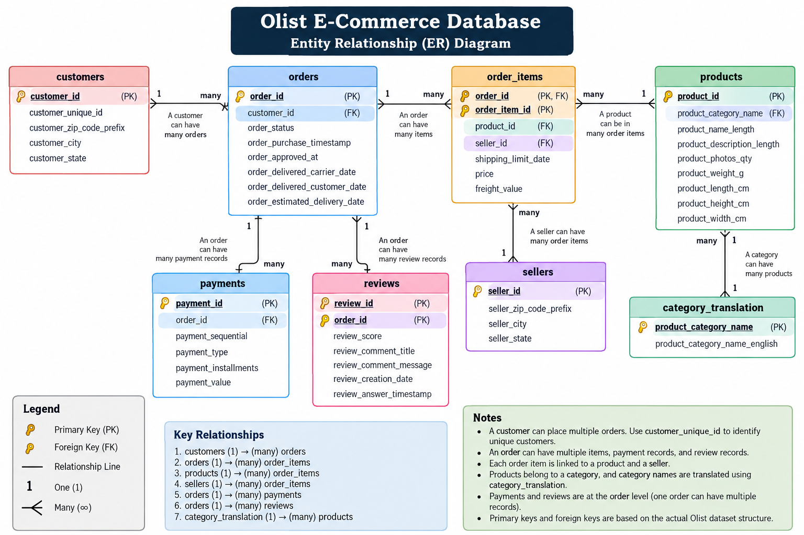

# Olist E-Commerce SQL Analysis

## Project Overview

This project analyzes the Olist Brazilian E-Commerce dataset using Microsoft SQL Server to uncover insights into sales, customers, products, sellers, payments, and delivery performance.

The project covers data validation, relational database design, SQL analysis, KPI development, and business insight generation.

The analysis focuses on understanding sales performance, customer retention, delivery efficiency, seller performance, payment behavior, and product trends.

## Tools & Technologies

- Microsoft SQL Server
- SQL Server Management Studio (SSMS)
- T-SQL
- GitHub

## Database Design

The project uses a relational database structure designed for analytical querying.

The main relationships include:

- Customers → Orders
- Orders → Order Items
- Orders → Payments
- Orders → Reviews
- Order Items → Products
- Order Items → Sellers
- Products → Category Translation

### Entity Relationship Diagram

## Key Business Insights

### Sales Performance

- The dataset contains approximately **99K orders** and **96K unique customers**.
- Total product sales were approximately **13.59M**.
- The average order value based on product sales was approximately **137.75**.
- Product sales showed variation across months, indicating changes in demand over time.

### Customer Behavior

- Approximately **3.12% of customers were repeat customers**.
- Repeat customers had a higher average product spend than one-time customers.
- One-time customers generated the majority of total sales because they represented the vast majority of the customer base.

### Delivery Performance

- Average delivery time was approximately **12.50 days**.
- Approximately **7.87% of delivered orders were late**.
- Late orders had a substantially lower average review score than orders delivered on time or early.
- This indicates a strong association between delivery performance and customer satisfaction.

### Product Performance

- **Health & Beauty** generated the highest product sales among the major categories analyzed.
- **Bed & Bath Table** had the highest unit volume.
- Higher-weight products generally had higher average freight costs.

### Payment Behavior

- **Credit card** was the dominant payment method.
- Credit card transactions also accounted for most installment-based payments.

## Business Recommendations

Based on the analysis, the following actions could be considered:

- **Improve customer retention:** Since repeat customers represent a small share of the customer base but have higher average spending, targeted retention campaigns could encourage more first-time customers to purchase again.

- **Monitor delivery performance:** Investigate sellers, regions, and periods with higher late-delivery rates to identify potential logistics and fulfillment issues.

- **Prioritize delivery experience:** Since late orders are associated with substantially lower review scores, improving delivery reliability could help improve customer satisfaction.

- **Optimize product strategy:** Use category-level sales, order volume, and average price to identify products and categories that contribute differently to sales performance.

- **Consider shipping costs in product decisions:** Freight costs increase with product weight, so heavier products may require closer monitoring of shipping economics.

- **Support flexible payment options:** Credit cards are the dominant payment method and account for most installment transactions, suggesting that installment options are an important part of the purchasing experience.

## Dataset

The project uses the Olist Brazilian E-Commerce Public Dataset.

The dataset contains approximately 100K orders and includes information about:

- Customers
- Orders
- Order items
- Products
- Sellers
- Payments
- Reviews
- Product categories
- Geolocation

The raw CSV files were imported into SQL Server and transformed into a clean analytical layer while preserving the original raw tables.
